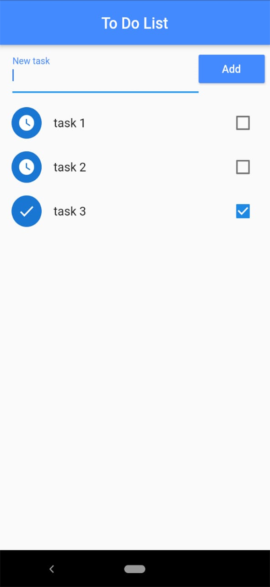

# **ToDo-list**




```bash
# Clone this repository
$ git clone https://github.com/jovanidesouza/todo-list

# Go into the repository
$ cd todo-list

# Remove current origin repository
$ git remote remove origin

# run development 
$ flutter run

```
